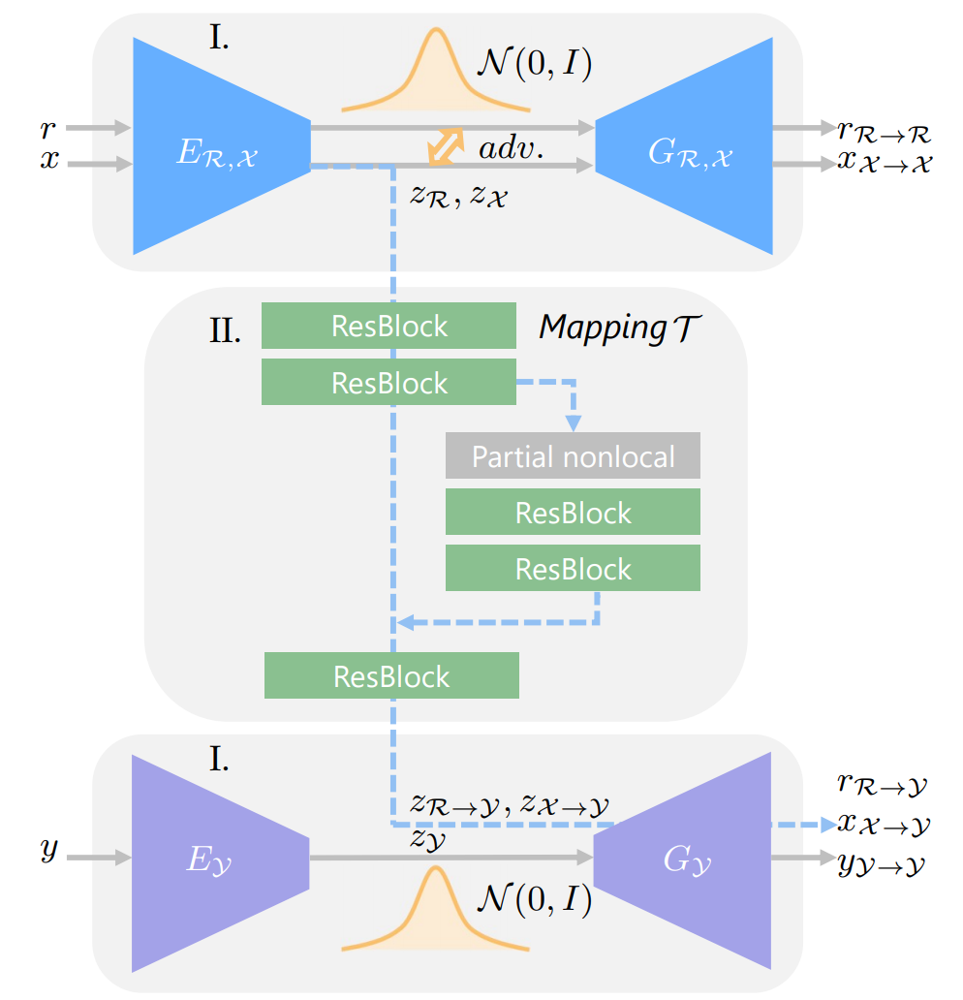
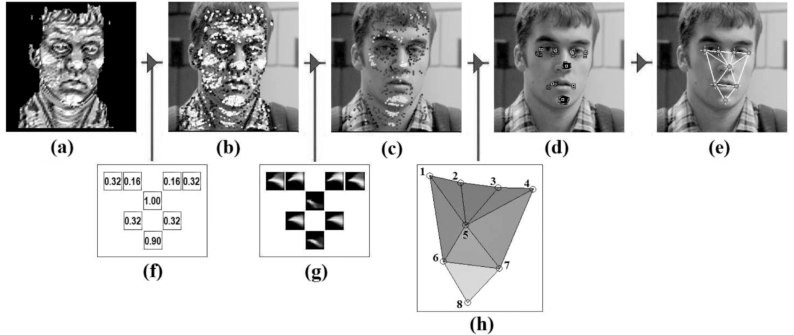
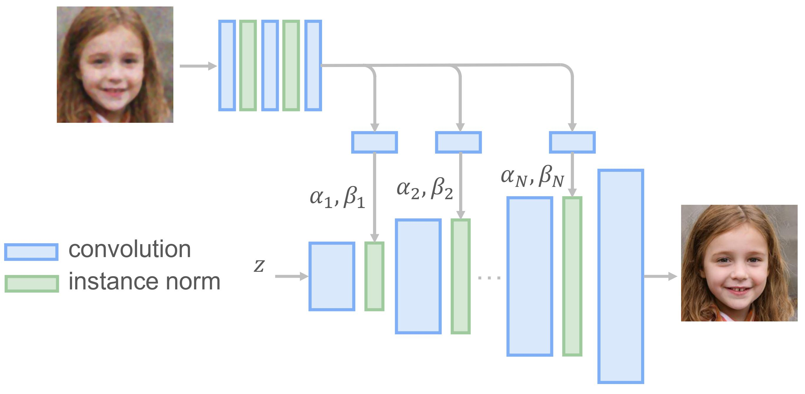

# Old Photo Restoration via Deep Latent Space Translation 

Play the [Colab](https://colab.research.google.com/drive/1W2kdJLuz4GqxuEsBk5rpgDTF6YnieWob#scrollTo=11db178d) and try it on your photos :sparkles: !

## There are 4 stages to restoring the resolution of old photos :

### 1) Global Restoration (Overall Quality Improve) :

A triplet domain translation network is proposed to solve both structured degradation and unstructured degradation of old photos.

### 2) Face Detection :

We use a landmark detection model to detect faces.

### 3) Face Enhancement :

We use a progressive generator to refine the face regions of old photos.

### 4) Blending All Stages :

In the last stage, we blend all the stages.

## Paper :
[Paper (Journal version)](https://arxiv.org/pdf/2009.07047v1.pdf)

